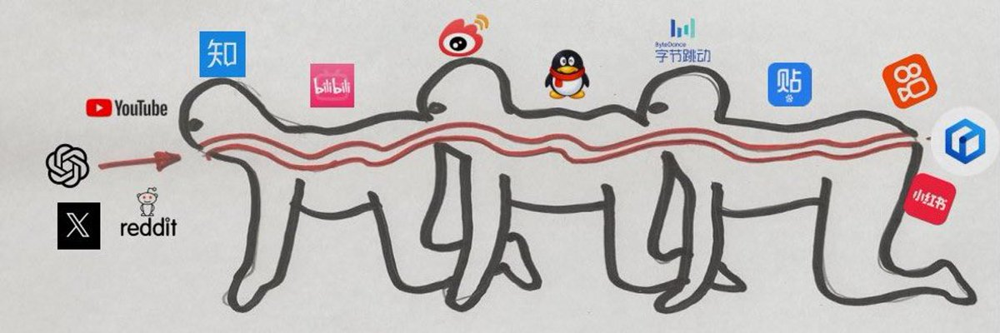

# Awesome-AISourceHub

## 写在前面

本仓库收集 AI 科技领域高质量信息源。
可以起到一个同步信息源的作用，避免信息差和信息茧房。

在线网址：[Ai Source Hub](https://www.aisourcehub.info)

信息源越接近于源头的内容越好呢？下面这张图可以简单解释 信息流垃圾理论简图

你认同这个图的顺序吗？
(小红书里面的一手信息还是挺多的，只不过没有办法贴上原文链接，是个硬伤)

**在这波人工智能浪潮中 Twitter 为什么重要？**

AI 领域的许多书籍作者、企业决策者和工具开发者经常使用 Twitter 并在此发表言论 Twitter 聚集了大量的天使投资人、风险投资人和记者，他们源源不断地提供着有价值的背景信息。因此，在 AI 的一波波浪潮中，Twitter 始终拥有着自己的「寓教于乐的小世界」。但 2022 年，ChatGPT 的诞生让 Twitter 在这场 AI 热潮中显得尤为重要 —— 人们在 Twitter 上大量分享他们使用这个工具的过程，关于 Generative AI 和 GPT-3 /3.5 的看法及围绕它们而产生的行为 —— 无论炒作与否。

**如何在 Twitter 筛选优质信息流?**

推特有各种大佬、各大官媒和民间高手。这些信息的全面性和时效性都非常好，只要用好关注列表，你基本不会错过。

1.首先要脱离推荐算法的圈养。把推特的时间线从【推荐】改成按【时间顺序】， 这样时效性会好很多。

2.找一个还不错的参考对象。可以是任何 AI 相关的账号，知名大 V 最好。从关注列表里面深挖你感兴趣的账号，点击关注。或者一次性的全部点击关注，后面看到不喜欢的内容再去取关就好。

平台：知乎博主、B 站 up 主、油管 Up、知识星球、电报、公众号、推特大 V、垂类 AI 网站

**挑选标准**

- 有干货
- 和人工智能、科技相关

**了解一个领域的常见技巧**:

1.谷歌学术搜关键词:找到 survey，或者引用数比较高的论文，然后用 ReadPaper 阅读和翻译。

2.如果是最新的论文:Arxiv 搜关键词。

3.看 PaperWithCode 的排行榜，比如: https://paperswithcode.com/sota

4.如果是代码复现，可以 Github 搜:awesome+xxx,一般会有大佬给你整理好相关的资料。

## 如何贡献

欢迎共享你的高质量信息源！请按照以下步骤操作：

1. Fork 仓库 - 点击此页面右上角的 "Fork" 按钮，将此仓库的副本创建在你的 GitHub 帐户上。
2. 克隆仓库 - 使用 git clone 命令将仓库下载到你的本地计算机。
3. 创建新分支 - 创建一个新分支，你将在其中进行更改。
4. 进行你的更改 - 在适当的类别中添加你的资源。请提供简短的描述和资源链接。
5. 提交并推送你的更改 - 使用 git commit 命令保存你的更改，使用 git push 将它们上传到 GitHub。
6. 打开拉取请求 - 转到原始仓库的 "Pull Requests" 选项卡，然后点击 "New pull request"。选择你的 fork 和你在其上进行更改的分支。点击 "Create pull request"，并简短描述你的更改。

当然你也可以通过下面链接来贡献你的信息源，审核过后会同步到仓库。

👉 [优质AI科技资讯源提交](https://youmiais.feishu.cn/share/base/form/shrcnSO8Eh1g6krlh4iuAkMVfYg)

## 资讯平台

| 平台链接| 备注 |
| ------------------------------------- | ------------------------------------------------------------------------------ |
| [推特](https://twitter.com/home)| 人工智能浪潮中信息前沿 |
| [公众号](https://mp.weixin.qq.com/) | 微信媒体 |
| [知识星球](https://zsxq.com/) | 干货比较多大都会开星球，但是也有很多割韭菜的 |
| [播客](https://www.xiaoyuzhoufm.com/) | 流行于欧美，音频方式分享知识 |
| [Arxiv](https://arxiv.org/) | 开放免费的科学研究论文预印本库，主要面向物理学、数学、计算机科学、经济学等领域 |

## X（推特 twitter）

| 大 V | 备注|
| --------- | --------- |
| [Twitter threads](https://readwise.io/twitter_leaderboard?threads) | 一个 Twitter 排行榜列表 |
| [OpenAI](https://twitter.com/OpenAI) | OpenAI 官方号，发布最强 AI 模型最新消息 |
| [Sam Altman](https://twitter.com/sama) | OpenAI 创始人，YC 前主席 |
| [Elon Musk](https://twitter.com/elonmusk) | 钢铁侠马斯克 |
| [Yann LeCun](https://twitter.com/ylecun) | Meta 前首席科学家|
| [Andrej Karpathy](https://twitter.com/karpathy)| 前特斯拉的 AI 总监，也是 OpenAI 的创始团队成员和研究科学家 |
| [François Chollet](https://twitter.com/fchollet) | 推特界最会研究人工智能的一位网红科学家，Keras 创始人 |
| [李飞飞](https://twitter.com/drfeifei) | 是斯坦福大学人工智能实验室的主任，她是计算机视觉和人工智能领域的领先专家之一 |
| [Soumith Chintala](https://twitter.com/soumithchintala)| FAIR 研究工程师、深度学习框架 PyTorch 创建者之一 |
| [Sebastian Raschka](https://twitter.com/rasbt) | 经常分享论文解读 |
| [clem](https://twitter.com/ClementDelangue)| HuggingFace 创始人兼 CEO |
| [Kevin Patrick Murphy](https://twitter.com/sirbayes) | 谷歌大脑/深度学习的研究科学家。|
| [Mark Chen](https://twitter.com/markchen90)| OpenAI 的研究部门负责人|
| [Connor Holmes](https://twitter.com/cmikeh2) | Sora 系统领导|
| [Tim Brooks](https://twitter.com/_tim_brooks)| Sora 研究领导|
| [AK](https://twitter.com/_akhaliq) | 知名博主 |
| [Jürgen Schmidhuber](https://twitter.com/SchmidhuberAI) | meta-learning (1987), GANs (1990), Transformers (1991), very deep learning (1991) 发明者|
| [宝玉](https://twitter.com/dotey)| 推特宝玉老师，知名博主 |
| [Jim Fan](https://twitter.com/DrJimFan)| Jim Fan, Nvidia 的科学家，经常分享 AI 相关 |
| [吴恩达](https://twitter.com/AndrewYNg)| 吴恩达， Coursera 联合创始人、斯坦福大学兼职教授、baidu AI 团队/谷歌大脑前负责人 |
| [歸藏](https://twitter.com/op7418) | 歸藏，经常分享 AI 最新资讯 |
| [Gorden Sun](https://twitter.com/Gorden_Sun) | 只发 AI 相关信息的产品经理，维护 AI 日报 |
| [Quo Le](https://twitter.com/quocleix) | Goole 大脑首席科学家，经常分享 Google 最新研究成果 |
| [Teslascope](https://twitter.com/teslascope) | 特斯拉车辆所有最新消息|
| [Binyuan Hui](https://twitter.com/huybery) | 阿里巴巴Qwen团队的NLP研究员 |
| [Tony Z. Zhao](https://twitter.com/tonyzzhao) | Meta GenAI的研究科学家 |
| [Eric Jang](https://twitter.com/ericjang11) |AI is Good for You作者 |
| [Zipeng Fu](https://twitter.com/zipengfu) | 斯坦福人工智能与机器人博士,分享从事的移动机器人最新进展 |

## 公众号

| 平台链接| 备注 |
| ----------- | ------------------- |
| [42 章经](https://mp.weixin.qq.com/s/0XOBiRjjTR8KZIB5eRxS5g)| 直接访谈 AI 领域最一线的大佬，纯干货 |
| [机器人大讲堂](https://mp.weixin.qq.com/mp/appmsgalbum?__biz=MzI5MzE0NDUzNQ==&action=getalbum&album_id=1610828918314319873&scene=126&sessionid=249306691#wechat_redirect) | 清华孙富春老师团队维护的平台，机器人必关注，干货多，软广少。 |
| [九章智驾](https://mp.weixin.qq.com/s/feScEzzUG44JbiuTCvZG6Q) | 自动驾驶领域的“顶会” |
| [我爱计算机视觉](https://mp.weixin.qq.com/s/MFbCt0XfOf9fV0YbdkmR6g) | 主要会介绍一些最新论文解读。也有一些软广 |
| [量子位](https://mp.weixin.qq.com/s/wZApA2MpnymBQ22Gqs93lQ) | 别管什么标题党，分享一些最新的比较火的资讯 |
| [机器之心](https://mp.weixin.qq.com/s/TyevzSaWihfxRA4ZZ0F1fg) | 别管什么标题党，分享一些最新的比较火的资讯 |
| [新智元](https://mp.weixin.qq.com/s/WqQWS-hiQ1i1Ve6IPH3djw) | 别管什么标题党，分享一些最新的比较火的资讯 |
| [Alwalker](https://mp.weixin.qq.com/s/3jctCVGpBXegwQgS5YLjvQ) | cv 相关的论文分享，干货比例高。|
| [cver](https://mp.weixin.qq.com/s/OWlM1a_7lbbhgVAuUOu_mQ) | 论文解读，开星球了，软广多。 |
| [计算机视觉 life](https://mp.weixin.qq.com/s/GxpZRfPgYFdNomGtFjLifA)| 主要是自动驾驶,也开星球了，软广多|
| [游戏葡萄](https://mp.weixin.qq.com/s/_u_QrjxF3M7Wk-gHKysiHQ) | 游戏领域:干货比较多，平台能接触到很多一线大厂的资源。|
| [老刘说 NLP](https://mp.weixin.qq.com/s/RPzuppX1Q13tFVum9aSZSA) | 原创干货比较多，少量付费，以及会维护一个付费社群，作者本身就是知识图谱和 NLP 专业出身，目前在 360 工作，所以信息量比营销号会好不少。 |
| [JioNLP](https://mp.weixin.qq.com/s/2ZFsvr80AxvpJIWQ2YHJwg) | 作者目前在昆仑万维 LLM 团队，喜欢开源，喜欢分享各种 AI 知识，干货比例会比较高。|
| [NewBeeNLP](https://mp.weixin.qq.com/s/a8hjzZ_Rzl6pOU1PRAARJQ)| nlp 相关内容，最新学术、技术贴，以及一些付费知识，广告。公众号的生态是这样的。大家按需关注。 |
| [GithubDaily](https://mp.weixin.qq.com/s/K5Hf2k6PXPLIq1DaQCWKag)| 会介绍一些 Github 热门的项目，现在主要是 LLM 相关的内容，有点标题党，有广告，有知识星球付费。大家按需关注。|
| [夕小瑶科技说](https://mp.weixin.qq.com/s/9_GKQUIYujIj2xcJ45fM4g) | 弱化版的三顶会，营销内容和比例大于三顶会。 |
| [36 氪](https://mp.weixin.qq.com/s/NpBt5GpoR0w3ONijngmVzw)| 和 LLM、AI 关系没那么大，但也是传统科技媒体了。|
| [Z Potentials](https://mp.weixin.qq.com/s/sVhQ8agFQSqqMrSMiB55vA) | LLM，AIGC 创业投资相关资讯。 |
| [爱可可爱生活](https://mp.weixin.qq.com/s/7hHz3IHqIF-UWC9eg3UhOA) | 其实微博才是大佬的主战场，大佬会分享一些最新的论文，如果有点评就更好了。 |
| [数字生命卡兹克](https://mp.weixin.qq.com/s/6_4SYTbMe8mSXJ4U1vIbqg) | 各种 AI 原创应用分享，以及新 AI 应用的介绍。有软广。 |
| [李 rumor](https://mp.weixin.qq.com/s/-9rrprjsaJVsNShpQ0uMJA) | 强化，大模型相关资讯分享，招聘信息发布，以及广告。 |
| [AI 科技评论](https://mp.weixin.qq.com/s/Bp5aLPd0klp0IzyuzrO-hw)| CSDN 旗下的公众号,相当于是弱版的三顶会。 |
| [将门创投](https://mp.weixin.qq.com/s/9hLM3kSvgOZXsrIaNcC94Q) | 干货较多，但更新频率不高，能有办法直接邀请论文作者做免费分享。 |
| [强化学习实验室](https://mp.weixin.qq.com/s/0fSJa3QQ_E5PQXNlukcHsQ) | 天大郝建业老师组的知识分享平台.他们分享的论文都比较重要，他们写的帖子也非常深入浅出。输出频率不算高，但比较稳定。|
| [硅星人Pro](https://mp.weixin.qq.com/s/QLdgjrWSRBou_7NEJGpkdg) | 会采访一些创业公司和科技公司，也分享一些 AI 相关的资讯，除了头条外另外的转载比例较高。 |

## 网站

| 平台链接 | 备注 |
| ----------------- | ----------------- |
| [GitHub Trending](https://github.com/trending) | Github 热榜，程序员必刷，祝大家早日登榜! |
| [Cool Papers - Immersive Paper Discover](https://papers.cool/) | 苏剑林大佬开发的一个刷论文的网站 |
| [科学空间](https://kexue.fm/)| 苏佬开发的 |
| [Daily Papers - Hugging Face](https://huggingface.co/papers) | 由 Huggingface 的 AK 大佬亲自维护的一个论文日榜，但对中文用户不太友好。|
| [MITNews](https://news.mit.edu/) | 应该是国内科技自媒体的上游信息源了。 |
| [paperswithcode.com/sota](https://paperswithcode.com/sota) | 一些领域的 Sota 方法排行榜。 |
| [菜鸟教程](https://www.runoob.com/)| 学的不仅是技术，更是梦想!:拓展技术栈比较好的网站 |
| [LLM-Arxiv](https://arxiv.org/list/cs.CL/recent) | 关于 LLM 的最新 Arxiv 论文列表，有空刷一下。这是原始信息源,是 Cool Papers 的简版 |
| [ShowMeAl](https://www.showmeai.tech/) | 乔 sir 维护的 Al 日报。一个 AI 信息的整合平台。|
| [Futurepedia](https://www.futurepedia.io/) | AI 应用目录，每日更新。|
| [Reddit ChatGPT](https://www.reddit.com/r/ChatGPT) | 成立于 2022 年 12 月, 目前观看次数最多的人工智能相关社区，拥有超过 350 万订阅者|
| [Reddit artificial](https://www.reddit.com/r/artificial/)| Reddit 人工智能社区，73 万订阅 |

## 播客

| 平台链接 | 备注 |
| -------------------------------------------------------------------------- | ---- |
| [AI 局内人](https://www.xiaoyuzhoufm.com/podcast/643928f99361a4e7c38a9555) ||

## 博客

| 平台链接 | 备注|
| --------------- | -------------- |
| [OpenAI Blog](https://openai.com/blog) | OpenAI 的官方博客，提供研究更新和深度分析，提供深度学习和人工智能相关的深度文章。 |
| [Google Blog](https://blog.research.google/) | Google AI 团队的官方博客，介绍最新的研究进展和应用，提供人工智能和机器学习的新闻和研究。|
| [Deepmind Blog](https://deepmind.google/discover/blog/)| DeepMind 的官方博客，介绍他们的研究成果和最新进展，提供人工智能和深度学习的最新研究成果。 |
| [Meta Blog](https://ai.meta.com/blog/) | Facebook AI 团队的官方博客，分享他们的研究和新的 AI 技术，提供 AI 的最新研究成果和应用。|
| [Nvidia Blog](https://blogs.nvidia.com/blog/category/deep-learning/) | 英伟达公司的官方 AI 博客，分享他们在 AI 和深度学习领域的最新进展和研究，提供了大量关于硬件加速、AI 应用和深度学习的深度文章。 |
| [Microsoft Blog](https://blogs.microsoft.com/) | 微软公司的官方 AI 博客，分享他们在 AI 和机器学习领域的最新研究和进展，提供了大量关于 AI 技术和应用的深度文章。|
| [Geoffrey Hinton](https://www.cs.toronto.edu/~hinton/) | Geoffrey Hinton，被誉为“深度学习之父”，他的个人主页分享了他在 AI 领域的研究和成果，提供深度学习和人工智能的深度文章。 |
| [Jason Brownlee](https://karpathy.github.io/)| Jason Brownlee 的博客，提供机器学习和深度学习的教程和文章，提供机器学习和深度学习的教程和文章。 |
| [Li&#39;Log:lilian](https://lilianweng.github.io/) | 基本上可以把一个领域，系统的梳理清楚。通俗易懂，深入浅出! |

## 知乎

| 博主 | 备注|
| -------------- | ---------- |
| [Hugging Face](https://www.zhihu.com/org/huggingface)| Huggingface face 官方号，会分享一些基础技术贴，工作日更新频率比较高。 |
| [苏剑林](https://www.zhihu.com/people/su-jian-lin-22)| 苏剑林:苏佬去年从追一去月之暗面了。玩知乎的，苏佬应该不用多介绍了。虽然大本营在他自己的科学空间，后面也会介绍，但知乎刷起来会更方便一些。唯一难受的是，苏佬很多帖子都需要一定的数理基础才能看懂。 |
| [李沐](https://www.zhihu.com/people/mli65) | 沐神，深度学习领域的重要人物，他的博客提供了许多有价值的深度学习和 AI 相关文章，B 站 有他的系列课程。 |
| [李博杰](https://www.zhihu.com/people/li-bo-jie) | 科大博士，前华为天少。师兄的知乎分享频率非常高，质量同样高，长文干货贴+脑洞+个人见解。领域几乎包含全 AI 领域，值得大家关注。|
| [李 rumor](https://www.zhihu.com/people/rumor-lee) | 北航，现在美团做 RLHF。其实公众号是她的主战场会分享一些有趣的 AI 知识。但感觉在美团做 RLHF，已经占用了她太多的时间了，更新频率没那么高了。|
| [刘聪 NLP](https://www.zhihu.com/people/LiuCongNLP)| 《ChatGPT 原理与实战》作者。LLM 的学术和行业信息。|
| [苏洋](https://www.zhihu.com/people/soulteary) | 大佬的经历一长串，泛 AI 领域的资讯，关注就行了。|
| [田渊栋](https://www.zhihu.com/people/tian-yuan-dong)| MetaFAIR 研究院研究员，CMU 机器人博士。之前做 MARL，做长文本小说生成，以及现在做 LLM，大佬非常强，在知乎的干货输出也很多，直接关注就行。|
| [毛航宇](https://www.zhihu.com/people/wan-shang-zhu-ce-de) | 北大博士，前华为诺亚，现商汤。之前做 MARL，现在弃坑，去做 LLMAgent 了，主要分享这两个方向的学术进展，个人见解，以及相关八卦。 |
| [信息门下跑狗](https://www.zhihu.com/people/xin-xi-men-xia-de-pao-gou/posts) | 北大跑姐，重拳出击学术造假，但最近更新频率也下降了。|
| [白小鱼](https://www.zhihu.com/people/youngfish42) | 上交。联邦学习相关干货知识分享，以及推荐各种 LLM 相关讯息。 |
| [桔了个仔](https://www.zhihu.com/people/huangzhe)| AI 领域大佬答主了。泛 AI 领域的咨询。 |
| [Al 小舟哥](https://www.zhihu.com/people/ai--53-32)| Huggingface 的大佬。但微信朋友圈的资讯都是一手最新的。|
| [王鹏程](https://www.zhihu.com/people/sikila)| 中科大。博主的想法会分享最新 arxiv 论文的图文介绍，刷起来很舒服。建议关注。 |
| [何枝](https://www.zhihu.com/people/who-u) | 电子科大，现在字节。大佬是分享 RLHF 教程和代码讲解火出圈的，做相关工作的可以关注一下。不过在字节工作，应该是比较难输出了|
| [东林钟声](https://www.zhihu.com/people/dong-lin-zhong-sheng-76) | 华科博士。博士方向是 RL+灵巧手。现在主要研究 LLM+灵巧手。大佬的干货比例和更新频率都比较好。 |
| [YY 硕](https://www.zhihu.com/people/yyss2037) | 卡内基梅隆大学博士。机器人领域的优质答主，关注就完事儿了。输出频率不高，但每个帖子都值得认真阅读。|
| [李淼 robot](https://www.zhihu.com/people/li-miao-8-1) | EPFL(瑞士洛桑联邦理工).博士，现在武汉某高校(隐约记得是武大)。李老师是机器人领域的优质答主，之前有比较多的教程贴，现在更新频率较低。 |
| [丁霄汉](https://www.zhihu.com/people/ding-xiao-yi-93) | 清华博士，现在腾讯 AIlab。主要分享一些关于学术写作、审稿、cv、AI 圈八卦和暴论。阅读起来比较开心 |
| [电光幻影炼金术](https://www.zhihu.com/people/zhao-ytc)| 上交博士，大佬的方向很杂，我刷了一圈都定位到具体专业。主要分享全领域学术进展、读研读博教程(包括写作、投稿、审稿、师生关系等)，更新频率比较高。|

## B 站 Up 主

| 平台链接 | 备注|
| ------------- | ------------- |
| [花儿不哭](https://space.bilibili.com/5760446?spm_id_from=333.337.0.0) | RVC 变声器创始人 GPT-sovits 作者，关注声音复刻的可以关注|
| [风信子的猫 Redamancy](https://space.bilibili.com/241286257?spm_id_from=333.337.search-card.all.click) | 数字人对话系统 Linly-Talker。 |
| [李自然说](https://space.bilibili.com/39089748?spm_id_from=333.337.0.0)| AI 连续创业者，对业界的思考很有价值。 |
| [差评君](https://space.bilibili.com/19319172?spm_id_from=333.337.0.0)| 一些 AI 领域评测和分享，范围较广|
| [耿同学讲故事](https://space.bilibili.com/1732848825?spm_id_from=333.337.0.0)| 北航老哥，战斗力非常猛，下饭利器! |
| [机器人科学与技术](https://space.bilibili.com/49975325?spm_id_from=333.337.0.0)| 会分享最新的一些国际大组的机器人演示 demo，但没有做更多点评。 |
| [图灵的猫](https://space.bilibili.com/371846699?spm_id_from=333.337.0.0) | 下饭视频看。|
| [小约翰可汗](https://space.bilibili.com/23947287?spm_id_from=333.337.0.0)| 说到下饭视频，必须得优可汗|
| [来自星星的何教授](https://space.bilibili.com/1010101551?spm_id_from=333.337.0.0)| 室温超导+学术八卦跑的最快的 up|
| [落英行者](https://space.bilibili.com/393702473?spm_id_from=333.337.0.0) | 各种尖端行业深度解析，很好奇素材都是哪儿来的。|
| [萌萌战队](https://space.bilibili.com/357669580?spm_id_from=333.337.0.0) | 空气动力学，激波!最像营销号的干货号。 |
| [二进制哈士奇](https://space.bilibili.com/475312678?spm_id_from=333.337.0.0) | 学术版 GPT 的作者，分享学术版 GPT 最新的功能。|
| [浪子之心科技](https://space.bilibili.com/431556168?spm_id_from=333.337.0.0) | 数字人，AIGC 开源项目介绍。 |
| [李鲁鲁](https://space.bilibili.com/1572312?spm_id_from=333.337.0.0) | AIGC、LLM 角色扮演、论文分享，大佬的知乎我忘记贴了! |
| [秋葉 aaaki](https://space.bilibili.com/12566101?spm_id_from=333.337.0.0)| AI 绘图界的喂饭级 Up，狠狠关注! |
| [五里墩茶社](https://space.bilibili.com/615957867?spm_id_from=333.337.0.0) | 最新的 LLM 相关工具分享，很多新工具都有新手入门，值得关注。 |
| [ShusenWang](https://space.bilibili.com/1369507485?spm_id_from=333.337.0.0)| 王老师的强化学习课和推荐系统课，都是免费的，讲的非常好! |
| [王树义老师](https://space.bilibili.com/314022607?spm_id_from=333.337.0.0) | 一些新 AI 工具的使用分享。比较适合小白。|
| [霍华德 vlog](https://space.bilibili.com/295428344?spm_id_from=333.337.0.0)| 华叔出走知乎，去了 B 站，现在主要分享 rwkv 的内容，以及一些泛 AI 的信息。 |
| [跟李沐学 AI](https://space.bilibili.com/1567748478?spm_id_from=333.337.0.0) | 深度学习论文解读和教程,关注就行，最近老师创业去了，断更了。 |

## 油管 Up 主

| 平台链接 | 备注 |
| ------------ | ---------------- |
| [李宏毅](https://www.youtube.com/channel/UC2ggjtuuWvxrHHHiaDH1dlQ) | 台湾科技大学的知名 AI 研究者，提供深度学习和人工智能的深度文章和视频。 |

## 电报

| 平台链接 | 备注|
| ------- | ------ |
| [ChatGPT / AI 新闻聚合](https://t.me/AI_News_CN) | 汇集全网 ChatGPT/AI 新闻|
| [极客分享](https://t.me/geekshare) | 分享各种高质量网站、工具、APP、开源项目等一切好玩的东西 🚀 |
| [AI 探索指南](https://t.me/aigc1024) | 关于 ChatGPT、Bard 等人工智能、思维方式、知识拓展，能力提升等。 |
| [AI News](https://t.me/aigcnote) | 记录 AI 业界大新闻和最有趣的新产品|

## 垂类 AI 网站

## 知识星球

  
## Star History

